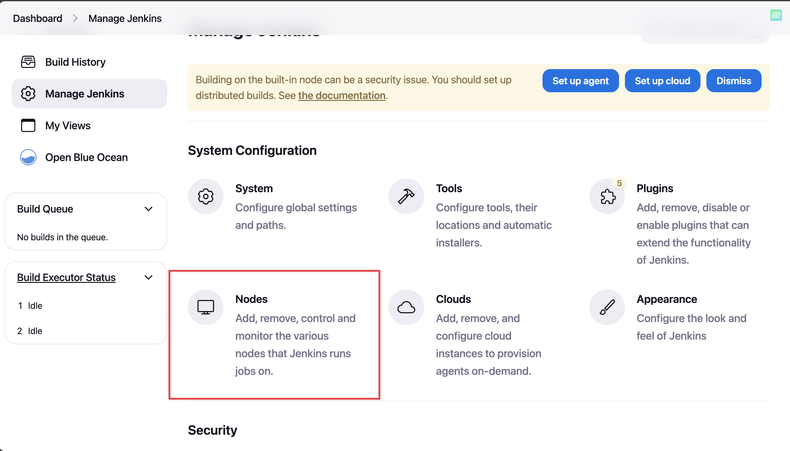
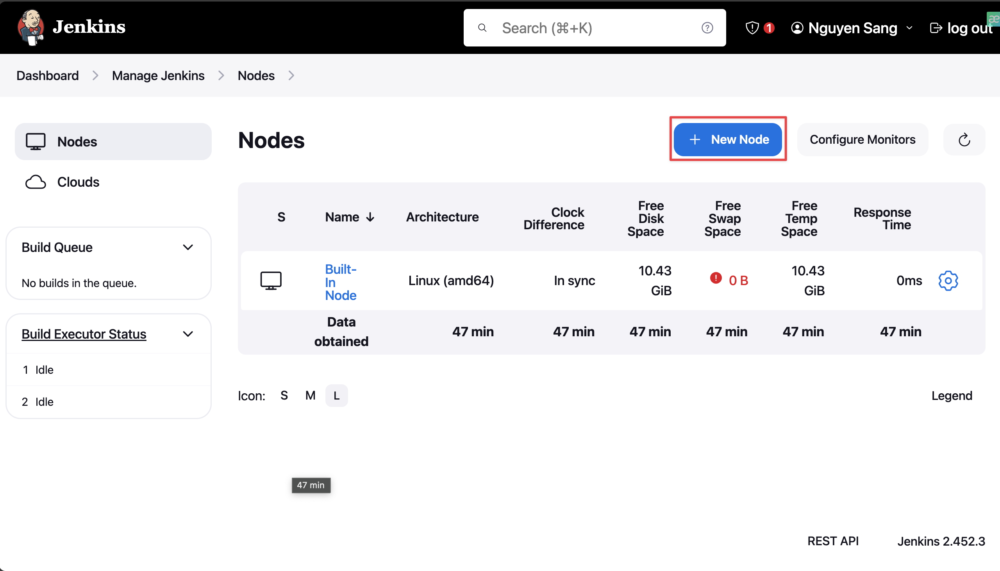
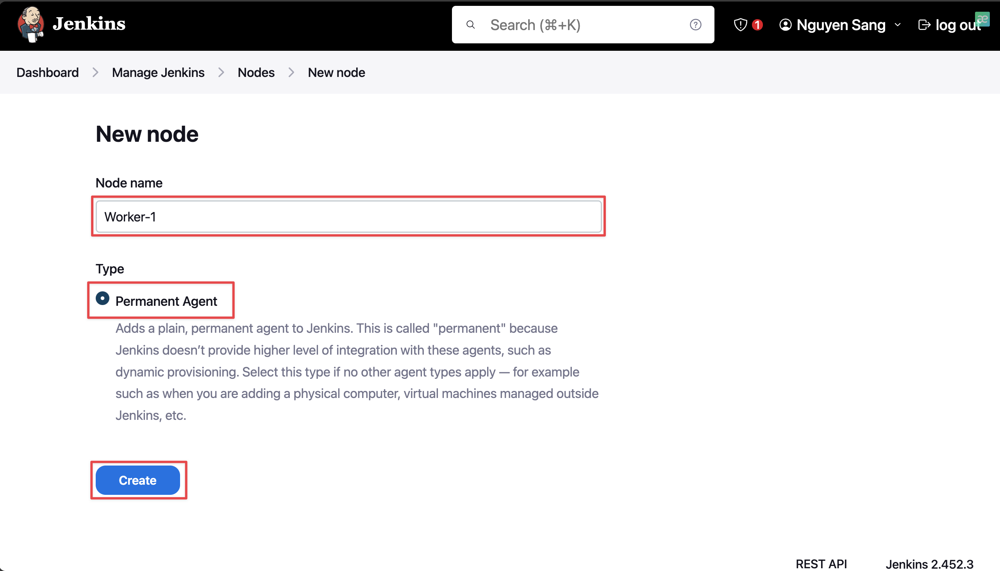
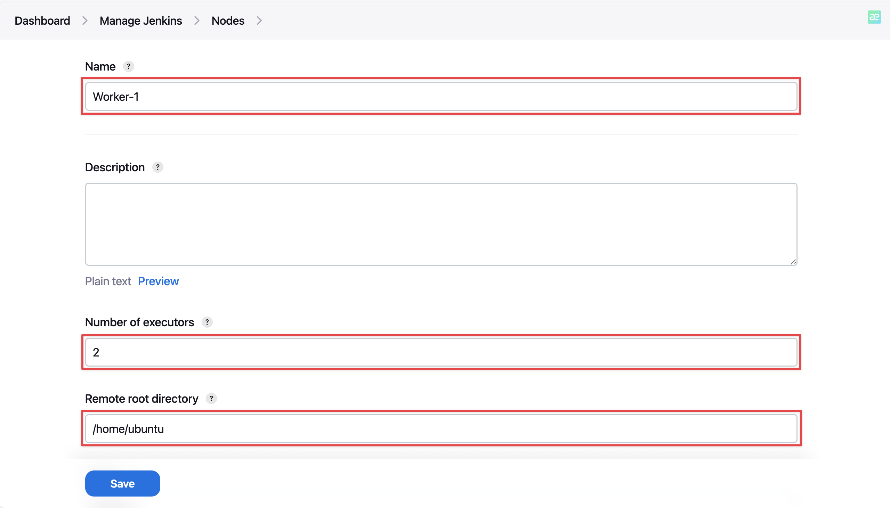
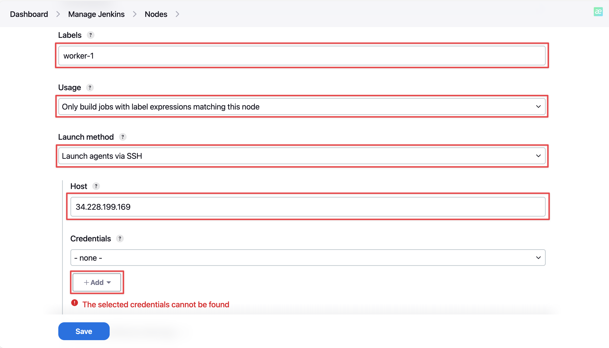
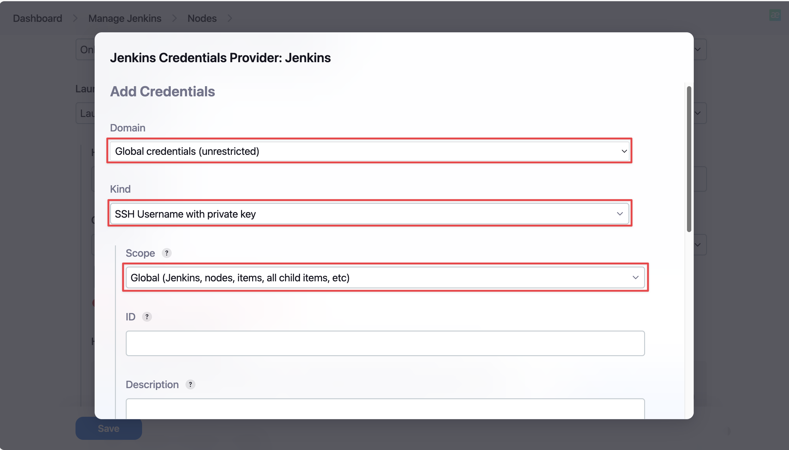
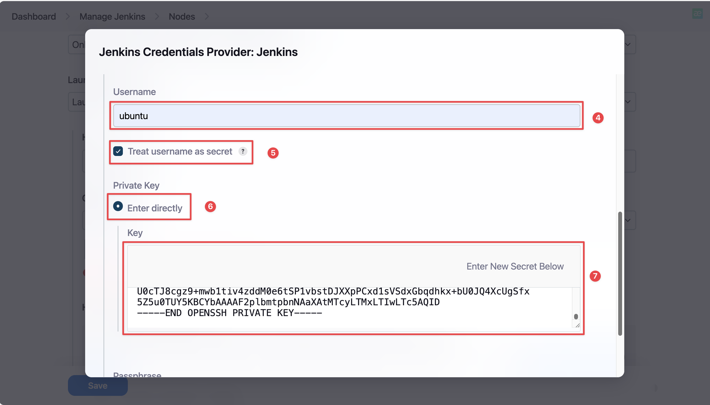
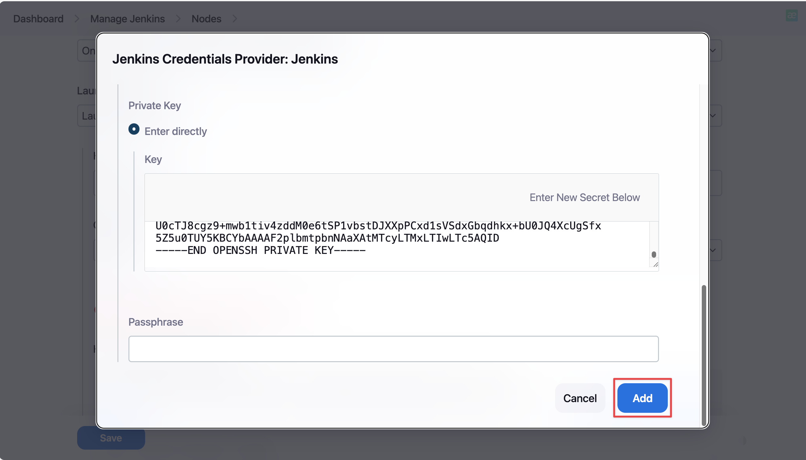
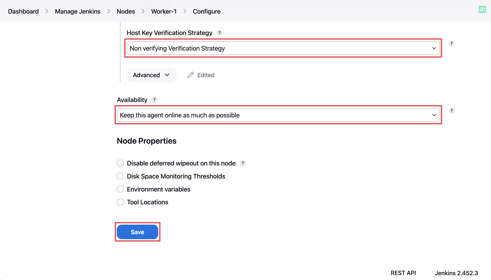
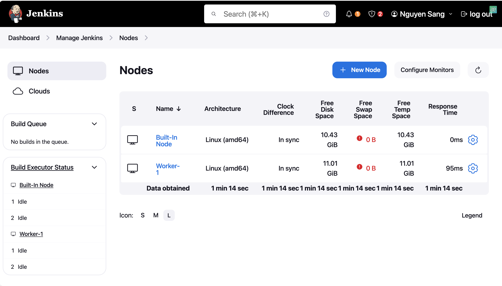

# 🚀 Distributed build with remote agent via SSH connection

---

Before starting, ensure you have basic understanding of Linux and Jenkins plugins.

## 🎤 Introduction

Jenkins follow the Master-Slave architecture, which means many slaves work for a master. It is also known as Jenkins distributed build.


Master node's tasks:

- Scheduling build jobs on Worker node.
- Monitor Slave nodes.
- Recording the build results.

Worker node's tasks:

- Perform the task that Master node schedules on.

> ![NOTE]
> About the Slave node, it isn't required to use the same OS as Master node but requires Java to be installed.

## 📝 Prerequisites

You have to prepare the following resoures to practice this workshop:

- 2 Linux machines can connect to each other over the network.
- One machine must be installed Jenkins(Master node) and another must be installed Java(Slave node).
- Master node have to install __SSH Build Agents__ plugin.

## 👉 Details

### 1. Configuration SSH connection
- In master node's terminal, we switch to __jenkins__ user, then generate a key pair that will be for SSH connection:

```
sudo su jenkins
ssh-keygen -t rsa
```
- By default, if you do not specify any custom path for storing keys, they will be located in */var/lib/jenkins/.ssh*
- Copy content in */var/lib/jenkins/.ssh/id_rsa.pub*
- Go to Slave's terminal, paste content to *~/.ssh/authorized_keys*  

### 2. Add Slave node

- In Jenkins'dashboard, go to __Manage Jenkins__:


- Select __Node__:


- Select __New Node__:


- Type in needed information and select __Create__:


- Do as follow:

  - __Number of executors__ is the quantity of maximum concurent build in this node.
  - __Remote root directory__ is where we perform build.

  - We configure the Slave node as being selected by label expressions.
  
- After select __Add__, we must copy the private key that we generated previously and then paste it here:


  - Username is the user which from Master make SSH login to Slave

- Select __Save__:

- Result:


> ![NOTE]
> Beside using remote Linux host as build agent, we can also configure Docker container or Kubernetes pod to become an agent.