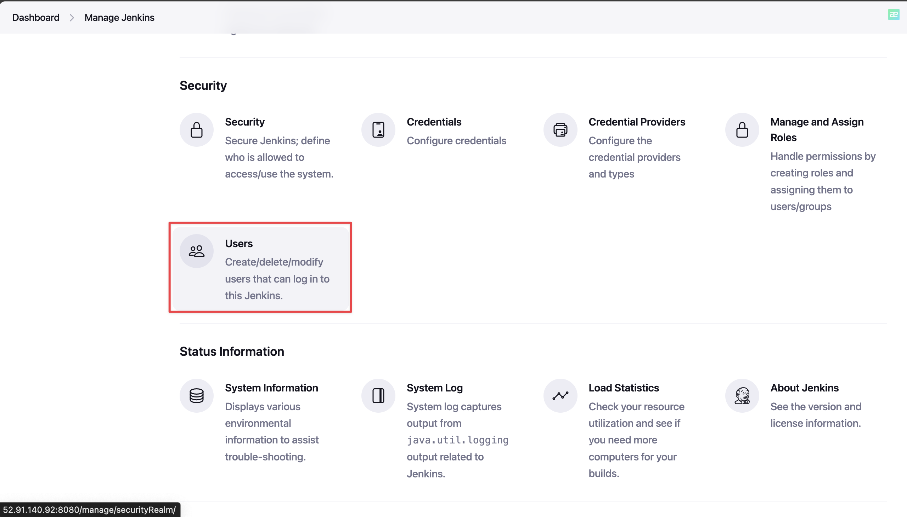
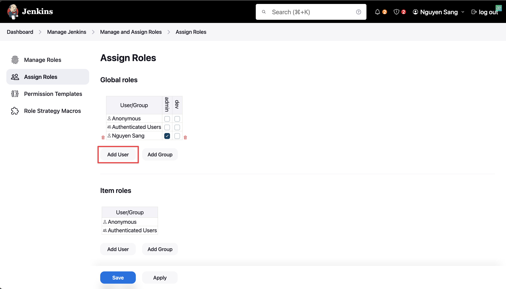

# 🚀 Jenkins security's aspects

---
> [!NOTE]
> Before starting, ensure you have basic understanding of Linux and Jenkins plugins.

## 🎤 Introduction

Jenkins user management involves controlling access and permissions within the Jenkins environment. It allows administrators to create, configure, and manage user accounts, defining roles and privileges to ensure that users have appropriate access to perform their tasks while maintaining the security and integrity of the Jenkins system.

This workshop will guide you how to manage users and roles in Jenkins.

## 📝 Prerequisites

You must have an already installed Jenkins on a machine(with any OS).

## 👉 Details

### 1. Install required plugin

- Go to __Manage Jenkins__

- Scroll down and select __Plugins__

- Click __Available plugins__ and search for __Role-based__

- Select the extension and click __Install__

- Restart Jenkins

### 2. Enable Role-based authorization

- Go to __Manage Jenkins__, scroll down and select __Security__:

- Under __Authorization__ section, select __Role-Based Strategy__, then click __Save__:

### 3. Manage users

- To create a new user in Jenkins:
  - On our __Dashboard__, select __Manage Jenkins__ and then choose __Users__ under __Security__ section:

  - Select __Create user__: 

  - Enter your new user's information, then select __Create user__:

- To update or delete user, select:

### 4. Manage roles

- Go to __Manage and Assign Roles__:

- To create a new role, select __Manage Roles__:

- Here I will create a role for developer, called *dev* which grant permissions for accessing Job and View:

- To assign this role for *tndev* user, do as follow:

- Result:
