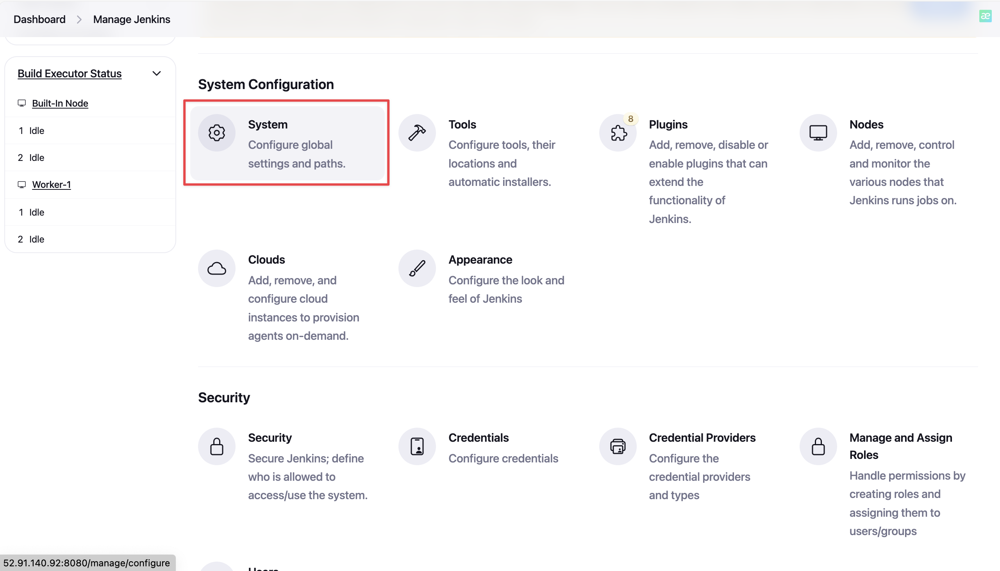
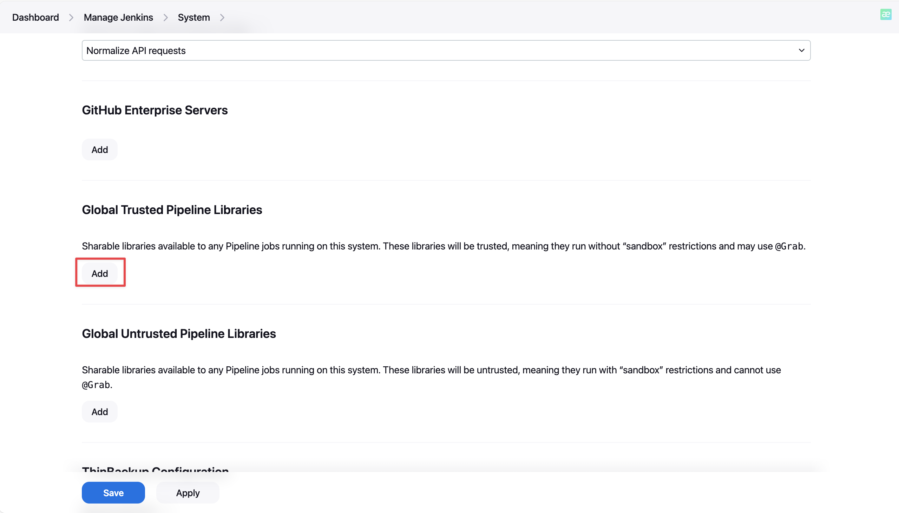
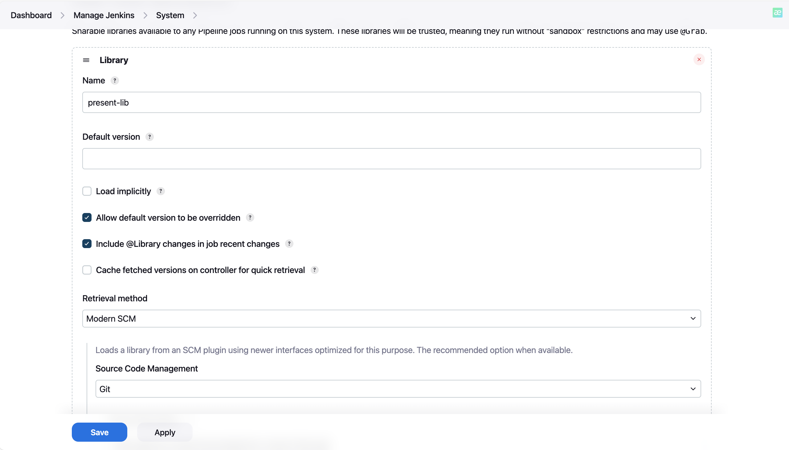
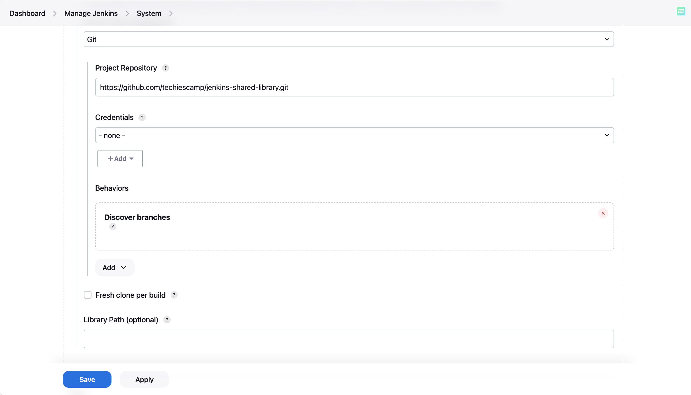
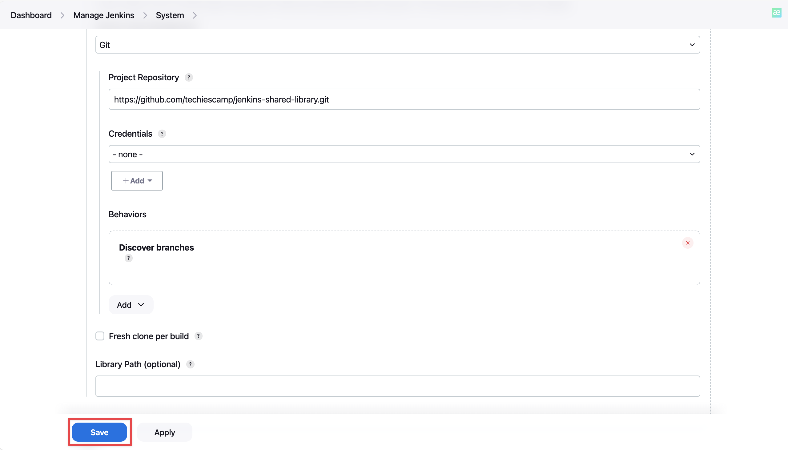

# 🚀 Backup Jenkins data and configurations to external disk

---
> [!NOTE]
> Before starting, ensure you have basic understanding of Linux and Jenkins plugins.

## 🎤 Introduction

Jenkins Shared Library is the concept of having common parts of pipeline's code, gather them in a central repository for reuse later. It is very similar to NPM library or Pip library.

In this workshop, I will show how to add a shared library to Jenkins, so that later in our pipelines we could reference it.

> ![NOTE]
> This workshop is about adding a library to Jenkins system and how to use it, not about writing our own shared library

## 📝 Prerequisites

To perform this workshop, you must prepare:

- An already installed Jenkins system
- A shared library, I have prepared one for you here: [Library](https://github.com/techiescamp/jenkins-shared-library.git)

## 👉 Details

- Go to __Manage Jenkins__, select __System__:

- Scroll down to __Global Trusted Pipeline Libraries__, select __Add__:

- Fill in as below:


- Select __Save__:

- Later, because I have disabled __Load implicit__, if we want to use that library in our pipeline, add __@Library__ annotation. For example:

```groovy
@Library('jenkins-library@master') _

pipeline {
    agent any
    stages {
        stage('Git Checkout') {
            steps {
            gitCheckout(
                branch: "master",
                url: "https://github.com/spring-projects/spring-petclinic.git"
            )
            }
    }
    }
}
```
