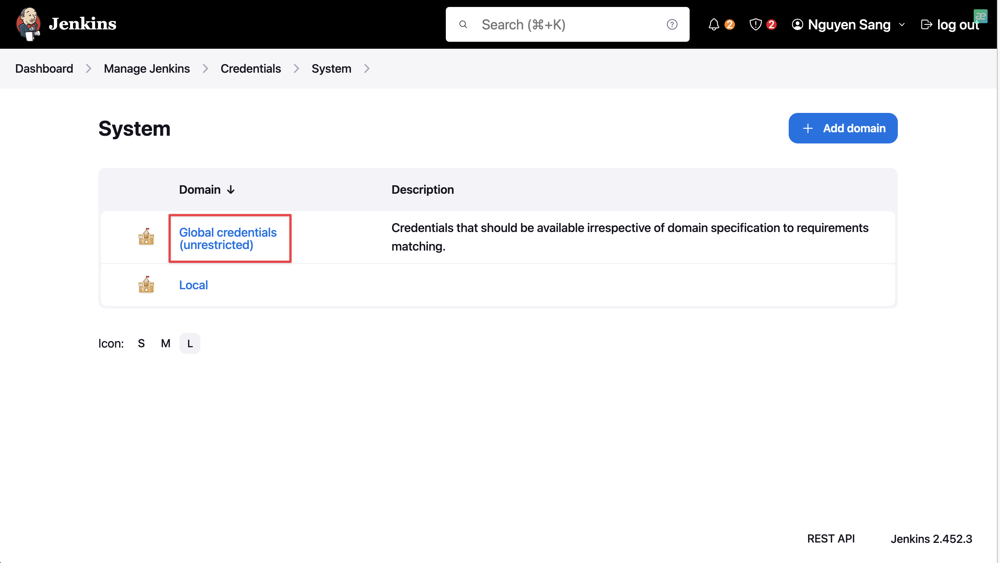

# 🚀 Backup Jenkins data and configurations to external disk

---
> [!NOTE]
> Before starting, ensure you have basic understanding of Linux and Jenkins plugins.

## 🎤 Introduction

There are two common problems with storing credentials on Jenkins:

- How pipeline handles credentials: Whenever a pipeline obtains a secret that is scoped, there are no limitations to it on how much and in what ways the pipeline can use them. This poses a potential security threat considering the pipeline may be interacting with uncontrolled external.
- The next problem with Jenkins is the use of its encryption methods. There is a static, single common master key and static single common hudson.util.Secret object. Both of these combine to encrypt our credentials. If access to our Jenkins host is compromised, we risk leaking these two keys and thus are credentials will be exposed.

This is where Vault comes to rescue, it helps to add another layer upon the credentials. 

## 📝 Prerequisites

To perform this workshop, these are prerequisites:

- A Linux machine with Jenkins installed.
- Vault is installed some where, could be the same machine where Jenkins is installed.

## 👉 Details

### 1. Configuring Hashicorp Vault

Hashicorp Vault provides us many methods for authentication, here we will use AppRole. To enable AppRole, run this command:

```bash
vault auth enable approle
```

- Firstly, we must create a role for Jenkins:

```bash
vault write auth/approle/role/jenkins-role token_num_uses=0 secret_id_num_uses=0 policies="jenkins"
```

- Next, we create a secret and store it in Vault:

```bash
vault kv put secret/dev-creds/git-pass test-git-creds=11111111
```

- Create a policy that grant access to this secret:

```bash
echo 'path "secret/data/dev-creds/git-pass" {
 capabilities = ["read", "list"]
}' > jenkins-policy.hcl
```

- Attach this policy to Jenkins's role:

```bash
vault policy write jenkins jenkins-policy.hcl
```

- Later, when configuring access to Hashicorp Vault for Jenkins, we need its role's secret id and role id. To retrieve they, run:

```bash
vault read auth/approle/role/jenkins-role/role-id
vault write -f auth/approle/role/jenkins-role/secret-id
```

### 2. Install Hashicorp Vault plugin

- Go to __Manage Jenkins__, select __Plugins__

- Select __Available Plugins__, search for Hashicorp Vault:

- Select plugin and click __Install__:

- Navigate back to __Credentials__:

- Select __System__:
  
- Choose __Global credentials__:

- Select __Add Credentials__:

- Select *Vault App Role Credential* as __Kind__:
  - Retrieve *Secret ID*, *Role ID* from the previous section:

  - Select __Create__:

- Navigate back to __Manage Jenkins__, select __System__, scroll down to __Vault Plugin__ section:
  - Paste Vault server's URL from previous section here and select the credential that we have created recently:

  - Select __Skip SSL verification__ because we had set up Vault server in *dev* mode, then select __Save__:


> ![NOTE]
> This workshop focus on integration Jenkins with Hashicorp Vault, in production, disable SSL connection is not 
encouraged

- To check if our configuration is working, create a pipeline with the following code:

- Result:

